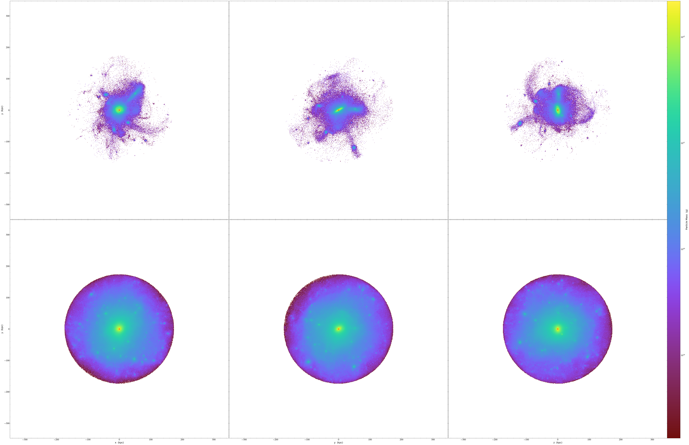
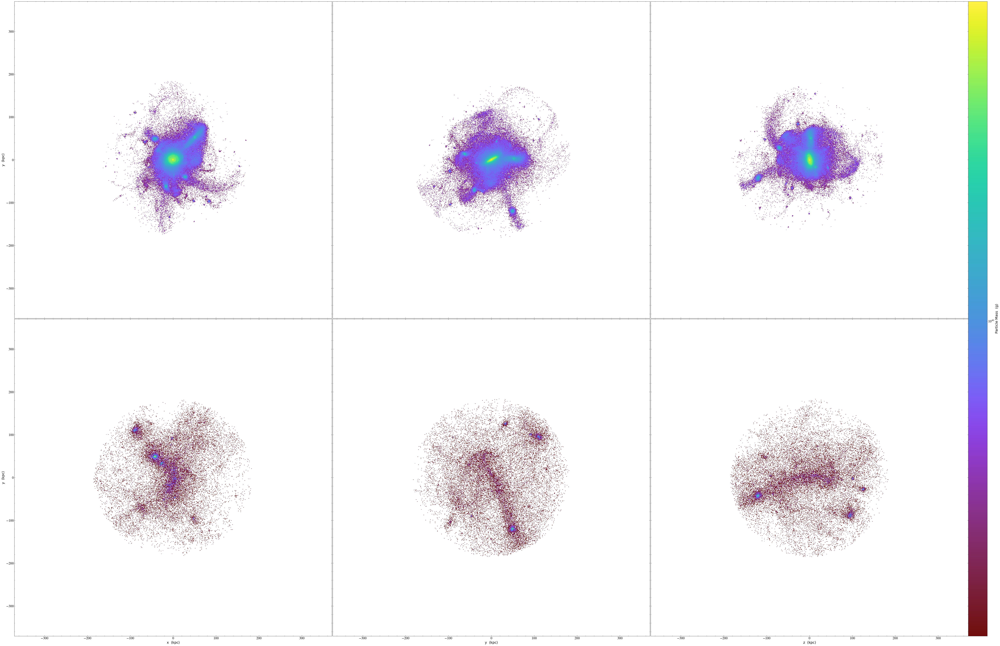
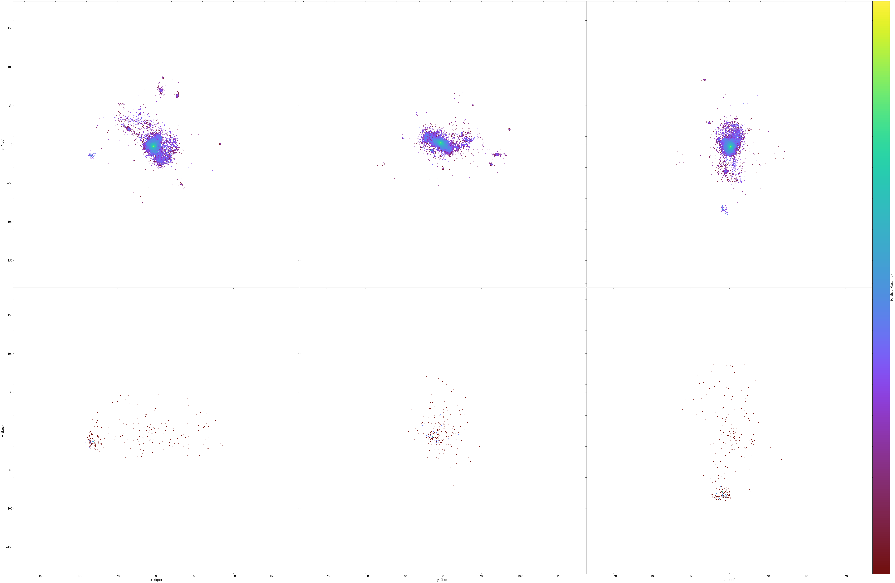
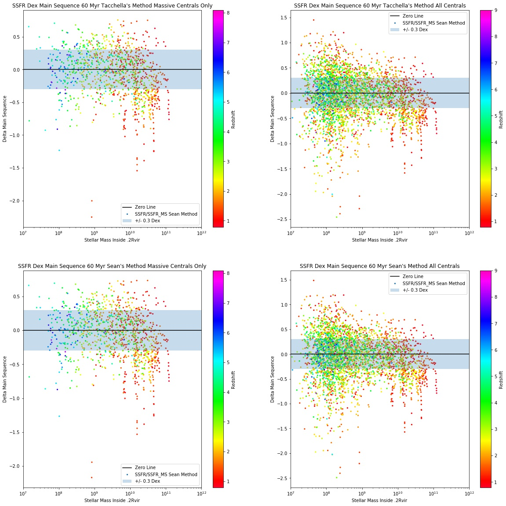

# VELAHalos

Developed by Sean Larkin

This is the VELAHalos, a collection of pipeline and analysis scripts for studying galaxies in the Generation 3 and Generation 6 VELA simulations, run by Daniel Ceverino. These scripts were designed to be used via terminal on the NAS pleiades and NERSC Edison supercomputers. While designed for VELA, and ART simulation, these scripts should work with any simulation format readable with the python yt package, although some names of fields may need to be changed.

# TO DO
-Update the GEN3snaps.py file to be more customizable on call with terminal?
-fix the o2 percent in gas_abundance.py
-graphs
-NERSC pipeline script

# Table of Contents

1. [Preparing VELA for Rockstar](#Preparing-VELA-for-Rockstar)
    - [Finding the VELA files to analyze](#Finding-the-VELA-files-to-Analyze)
    - [Art to Ascii](#Art-to-Ascii)

2. [Rockstar Post Processing Scripts](#Rockstar-Post_Processing-Scripts)
    - [Proper Mvir Calculation](#Proper-Mvir-Calculation)
    - [SFR and Contamination](#SFR-and-Contamination)
    - [Gas Abundance and Metallicity](#Gas-Abundance-and-Metallicity)
    - [Log Spaced Profiles](#Log-Spaced-Profiles)

3. [Pipeline Scripts](#Pipeline-Scripts)
    - NAS Pleiades
    - NERSC Cori

4. [SQL Scripts](#SQL-Scripts)
    - [Rockstar](#Rockstar)
    - [Propermvircalc, SFRandcontamination, and Gas Abundance](#Propermvircalc,-SFRandcontamination,-and-Gas-Abundance)
    - [Merged Catalogs](#Merger-Catalogs)
    - [Paper Image Scripts](#Paper-Image-Scripts)

5. [Other Useful or Older Scripts](#Other-Useful-or-Older-Scripts)
    - [Rockstar and Consistent Catalog Readers](#Rockstar-and-Consistent-Catalog-Readers)
    - [Rockstar and Consistent Catalog Scripts](#Rockstar-and-Consistent-Catalog-Scripts)
    - [Tomer Catalog Reader](#Tomer-Catalog-Reader)
    - [Nir Catalog Reader](#Nir-Catalog-Reader)

6. [Other Directories](#Other-Directories)
    - [Mass Relations](#Mass-Relations)
    - [graphs](#graphs)

5. [Accessing my Data](#Accessing-my-Rockstar-Runs-on-Pleiades)

## Common Terms

VELA_dir: The location where the VELA simulation you want to analyze is located. This should be the folder with the 10MpcBox, PMcrda0, PMcrs0a0, and stars_a0 files are.

consistent_dir: The location where the consistent trees .hlist output files are. Should be in the form path/to/hlists.

out_dir: The location where you want the outputs (images, rockstar catalogs, etc.) placed.

VELA_number: The number of the VELA simulation you are working with currently. For example, 07 for VELA07, or 14 for VELA14.


## Dependencies

To run this pipeline, you will need these python packages:

- yt
- astropy
- pandas (for the Tomer catalogs)
- numpy and matplotlib (these are dependancies for yt so you wont need to worry about them if you use anaconda)

# Preparing VELA for Rockstar 

## Finding the VELA files to Analyze

For the Generation 3 VELA simulations, all of the time-steps were saved. For my analysis, I only focused on the time-steps closest to delta-a of 0.0025, starting at a of 0.1 and ending at a of 0.5. In order to sort through all of the files, and find the ~30% of total snapshots I was interested in on Pleiades, I used the script [GEN3snaps.py](VELAscripts/GEN3snaps.py).

This script takes the timing logs of all of the GEN3 simulations, and iterates through each of them, finding the snaps closest to the times you are interested in, and then writing all of the simulation numbers and scale factors to an .ascii file, where it also includes a shiftc command to move all of them to a directory at once. To change the time-steps it looks for, change the values of the list generator on line 7 to 

`
list_of_wanted_snaps = [i for i in np.arange(starting_a, ending_a + delta_a, delta_a)]
`

where starting_a is the starting scale factor you are interested in, ending_a is the last snapshot you are interested in, and delta_a is the time resolution you want. 

## Art to Ascii

[Rockstar](https://bitbucket.org/gfcstanford/rockstar/src/master/README.md), developed by Peter Behroozi, is a 6-D Friends of
Friends halo finder. While rockstar had been used to analyze the Bolshoi Planck cosmological simulations, another ART simulation, the formatting of the two art formats are incompatible. As a result, rockstar could not be directly run on the VELA simulations, as their ART headers varied significantly. In order to get around this, I used the yt-project to reformat the VELA particle data to the basic ASCII format that works with rockstar.

To do this, the script [arttoascii.py](VELAscripts/arttoascii.py) was used. To call this script, use the command

```
/path/to/satellite_analysis/VELAscripts/arttoascii.py VELA_dir out_dir
```

I often used the VELA_dir as the out_dir to keep the simulation files together, but if space is a concern, they can be kept separate for easy management.

# Rockstar Post Processing Scripts

The rockstar version I used was the single mass rockstar, which can only read particle data if they share the Mass. As the VELA simulations use a variety of particle masses for the stars and dark matter, rockstar was run only on the smallest mass dark matter particles. As a result of this, its calculations of several galaxy properties like the Virial Radius, Virial Mass, etc were smaller than if the stars and gas were included. Because of this, I used the galaxy outputs of rockstar, and ran a suite of post processing scripts to find more accurate halo measurements of several paramaters; Mvir/Rvir, SFR, Higher Mass Dark Matter Contamination, and Metallicity. Below I include a decription of these scripts and their dependancies.

## Proper Mvir Calculation

As rockstar underestimates the size of the halos it finds as a result of only looking at the dark matter, to properly analyze the halo population, recalculating the Virial Mass and Radius are of upmost importance. The program [propermvircalc.py](VELAscripts/propermvircalc.py) takes the halos found in the rockstar catalog larger than a given mass, and recalculates their virial mass. To do this, it creates a profile of the gas, stars, and dark matter of the galaxy out to 2-2.5x times the virial radius found by rockstar. It then finds when the right delta_vir for the current epoch is based on the Virial function from Byron and Norman ???? within 1/5000 of the virial radius of rockstar, which is usually around 0.002 kpc, which is much lower than the error caused by the fitting to a not truly spherical profile or the gas-mesh resolution of 17.5 pc for the inner regions at late times.

After it finds this 'proper' Mvir and Rvir point, it saves the profiles it generated for the gas and stars, and calculates the gas, stars, and dark matter found within 10%, 15%, and 20% of the newly found rvir, and saves them as well.

This also generates images of the 3 2-d projections of the stars and dark matter within each halo, and saves them. The file names tell you about the halo in question, and are formatted in this way: aXXX_Y_ZZZZZZ.0.png where XXX is the scale factor of the current time, Y is the halo ordering based on size of those for this snapshot (0 being the largest, 1 the second largest, 2 the third largest, and so on), and ZZZZZZ being the halo_id as defined by consistent trees. 

Here is what this looks like for the Generation 6 VELA07 Largest Halo at scale factor 0.500.



To run this script, you need the location of the consistent-trees hlists, and the location of the VELA simulation files, and run the following command.

```
/path/to/satellite_analysis/VELAscripts/propermvircalc.py VELA_dir consistent_dir out_dir
```

*NOTE ABOUT Skipping Halos: In my analysis, I found one halo where this script failed for finding its virial radius and mass. I could not find the reason for this, so this script is designed to skip over halos where this process fails. If you want to find any that have failed, you can compare the number of images made to the number of halos in the output file, as the images are created before this discrimination happens. The other scripts in this section will still work if any are skipped.

## SFR and Contamination

Another important property to understanding halo evolution is the Star Formation Rate (SFR). The [SFRandcontamination.py](VELAscripts/SFRandcontamination.py) script takes the proper rvir values from the previous script, and calculates the SFR and SSFR for several stellar populations and radii. All populations are calculated for those populations within 10%, 15%, and 20% of the virial radius. The stellar populations considered are as follows:
- The Stars Formed since the last time-step
- The Stars Formed within the last 2, 3, 4, and 5 time-steps
- The stars formed within 60 and 100 Myr
- The stars formed 5, 60, and 100 Myr according to the formula from Tacchella et al. 2016

In addition to the SFRs, this script also sees if any of the higher mass dark matter particles from the less resolved outer regions of the ART code have contaminated any of the halos. This is used primarily as an exclusion parameter for those halos with high contamination (mass of contaminating particles reaching 10% of the total Virial Mass). 

This script, like the propermvircalc script, also makes projections of halos, but only in certain conditions. There are two cases where images are made; if the contamination of larger mass dark matter particles exceeds 1% of the total virial mass, and if there are any dark matter particles of the 3rd and larger masses, as those being present means something very strange is afoot.

The first image where dark matter contamination exceeds 1% of the virial mass, it is saved to a file in this format:
darkmatter_contamination_aXXX_id_ZZZZZZZ, where XXX is the scale factor, and ZZZZZZ is the consistent trees halo id. The top row plots the stellar particles and the bottom row plots the higher mass dark matter particles so it can be seen where they have entered the halo. Here is an example for from GEN6 VELA07 at redshift 0.500.



The second image plotting the larger dark matter contamination is formatted as follows: darkmatter_contanimation_larger_particlesQQQ_aXXX_idZZZZZZ.png, where QQQ is the number of larger particles, XXX is the scale factor, and ZZZ is the halo id. Here is an example from GEN6 VELA09 scale factor of 0.460.



To run this script, you need the location of the consistent-trees hlists, the location of the VELA simulation files, and the location of the outputs from the above propermvircalc script, with the following command.

```
/path/to/satellite_analysis/VELAscripts/SFRandcontamination.py VELA_dir consistent_dir propermvircalc_dir out_dir
```

## Gas Abundance and Metallicity

This script calculates the amount of hydrogen and oxygen in each halo for comparing with mass-metallicity relations. The hydrogen is taken to be 75% of the mass of the total gas mass, and the oxygen is 50% of the Type 2 Supernovae ejections. It also calculates the Type 1a supernovae ejections as well. These masses are calculated at 2%, 4%, 6%, 8%, 10%, 15%, and 20% of the proper rvir to allow for the metallicity gradient to be calculated. 

To run [gas_abundance.py](VELAscripts/gas_abundance.py), just like the SFRandcontimantion script above, you need the location of the consistent-trees hlists, the location of the VELA simulation files, and the location of the outputs from the above propermvircalc script, with the following command.

```
/path/to/satellite_analysis/VELAscripts/gas_abundance.py VELA_dir propermvircalc_dir consistent_dir out_dir
```

## Log Spaced Profiles

While the propermvircalc script generated profiles of each halo, those profiles were spaced linearly. As many papers use log-spaced profiles, this script ([logprofiles.py](VELAscripts/logprofiles.py)) creates a profile of 30 evenly log-spaced spheres out the proper rvir and calculates the mass of stars, dark matter, and gas within each.

To run this, you once again need location of the consistent-trees hlists, the location of the VELA simulation files, and the location of the outputs from the above propermvircalc script, with the following command.

```
/path/to/satellite_analysis/VELAscripts/logprofiles.py VELA_dir propermvircalc_dir consistent_dir out_dir
```


# Pipeline Scripts

If you would like to run any of these scripts on the VELA simulations, or on another yt compatible simulation, I have included example bash scripts for the NASA Pleiades and NERSC Cori supercomputers. 

## NAS Pleiades

## NERSC Cori


# SQL Database Scripts
To make retrieving specific data easier for more complex calculations and plots, I created a sql database. If you want to create a copy of my database, I created a series of python scripts to allow for the automatic creation and checking of each sql table, and one that creates a main table joined for each individual galaxy in my rockstar post processing outputs. This mergedcatalog also creates an index of halo projenitors, allowing you to track halo evolution without having to refer back to the concurrent trees outputs. In the next subsection, I outline each script in my database generator, and in the one that follows, I include scripts for generating the plots and other useful information from the database.

There are two sets of scripts, one for GEN3 and one for GEN6. I separated them to prevent accidental adding of one generations halos to the other.

## Rockstar

This creates a catalog for the entire consistent trees output files. This is the largest table by far, and it not required if space is an issue. You can also use this script to extract just the information of the merger trees for the halos that we post processed, and create a merger tree table here, which will also work for the merged catalog script.

## Propermvircalc, SFRandcontamination, and Gas Abundance

These scripts convert the outpus files of the listed python scripts to sql databases. 

## Merged Catalogs

This is the main sql script that makes life much easier. This process does two main things, first it joins all the databases so that the information of all extracted values for each halo can be called from one database. It also, it also creates a new column called projenitor_number from the merger information from the rockstar table or from the merger information table. The projenitor number is an integer that indicates which halos from each VELA sumulation are of the same branch of the merger tree, allowing easy tracking of each halo through its evolution. The halos with projenitor_number of 1 are the main central halo of which the simulation is centered. Then, each lower central halo is given a successive projenitor_number based on how many timesteps it exists for.

## Paper Image Scripts

This section includes the python and sql processes for generating the images used in my paper. As my paper is not yet complete, this section is currently empty, as I am still finalazing them. Here is a quick sneak peak of what is to come.



# Other Useful or Older Scripts

The most called programs I have made are my catalog readers. These programs are usually the first thing called in my analysis scripts. They are used to parse through the entire catalog of halos for a given VELA, and get all of the halos of the wanted parameters, usually for graphing. 

## Rockstar and Consistent Catalog Readers

These two scripts ([rockstarcatalogreader.py](catalogreaders/rockstarcatalogreader.py) and [consistentcatalogreader.py](catalogreaders/consistentcatalogreader.py) do the same process for the two different catalogs made by the rockstar/consistent trees halo finding. I recommend using the consistent trees catalogs, but if you have only run rockstar and are not planning on using consistent trees, you can use the rockstar reader with a few modifications. NOTE: if you do plan on using the rockstar reader for some of the scripts that only exist for consistent trees, the index for the two catalogs rows differ, so they will need to be changed.

To call the Consistent Catalog Reader use 

```
from satellite_analysis.catalogreaders import consistentcatalogreader as consistent

consistent.conistent_catalog_reader(consistent_dir, remove_subhalos='False', halo_mass=mass)
```

The remove_subhalos and halo_mass are optional arguments. If you want the reader to remove all of the subhalos from the halo data, set remove_subhalos='True', the default is 'False', which keeps the subhalos in. The halo_mass is the mass in MSun that the reader will remove halos smaller than that size. The default is set to 10e+08.

This script generates a list of lists, with length of the total number of snaps for a given simulation. Each list is contains a series of tuples, with each tuple including all of the data included in the consistent trees hlist catalogs, sorted by halo mass, with the largest halo found in the first tuple, and so on. To call the largest halo from the third snapshot, use

```
consistent.halo_data_sorted[3][0]
```

If you want a list of all of the scale factors for each snapshot, use 

```
consistent.consistent_file_index
```

### Tomer Catalog Reader

For several of my scripts, I do a comparison to others analysis of the VELA simulations. The data for these comparisons comes from Tomer Nessbaum's pandas catalogs. They contain data gathered by Nir Mandelkir, Sharon Lapiner, Tomer Nessbaum, and others. For more info on this catalog, contact Sharon Lapiner. You can find this script here: [tomercatalogreader.py](catalogreaders/tomercatalogreader.py)

To call this catalog use

```
import pandas as pd
from satellite_analysis.catalogreaders import tomercatalogreader as tomer
```

For more info on what is in the catalog, and to see how to call the info you want from pandas data structure, see the using this catalog that is included in it.

## Nir Catalog Reader

Also useful is comparing directly to just the halo catalogs created by Nir Mandelkir. These find many properties of the largest halo in each snapshot that are not calculated in my pipeline, as well as some improved versions of some that are.

To call this catalog, use:

```
from satellite_analysis.catalogreaders import nircatalogreader as nir
nir.nircatalogreader(GEN, VELA_number)
```

where GEN is the generation of VELA simulation you are looking into (3 or 6). You will need to update the script [nircatalogreader.py](catalogreaders/nircatalogreader.py) to point to the correct directories where these catalogs are placed.

## Rockstar and Consistent Catalog Scripts 

If you do not have access or interest in creating a SQL database for this data, there are a number of scripts that work from the .ascii outputs of the rockstar or consistent trees catalogs. These are earlier versions of scripts found in the rockstar post processing and SQL section, so they may not have the full functionality of them, but they preform mostly the same processes.

### Rockstar Scripts

- stellarmassrealtion.py: This calculates the mass of the stars, gas, and dark matter within 1 rvir based on the rockstar catalogs dark matter only calculation of rvir.
- massdistancecomparison.py: This plots the distribution of satellites as a function of distance from the central galaxy they are a satellite of.
- catalogprojections.py: This creates images of each high resolution region for each VELA time-step, and overplots the locations and virial radii of the rockstar catalog so the sizes of the galaxies can be seen. Good tool to see if rockstar is missing any obvious halos.
- halorvirdensityprojections.py: This creates images of the largest object in each time-step out to 1 rockstar rvir, and compares the rockstar rvir to those found in the Tomer catalogs.

### Consistent Scripts

- stellarmassrelation.py: After rockstar is run, the stellarmassrelation.py script can be run on the consistent trees data to extract the stellar mass and gas mass for each of the galaxies found. This script find the stellar mass within 3 multiples of the Virial Radius, .1, .15, .2 and 1.0 of the RVir. It also finds the gas within 1 Rvir. The process for finding the gas mass is very time intensive, due to yt needing to deconstruct the oc-tree of the VELA sims, so while other radii can be looked into, I have not yet done such analysis. This script is an early draft used for some preliminary investigations, but is not the most accurate for the VELA simulations. I recommend using the post processing scripts included above.
- Planes of Sattelites.ipynb: This jupyter notebook file takes and finds the planes of satellites around objects.
- catalogprojections.py: This creates images of each high resolution region for each VELA time-step, and overplots the locations and virial radii of the rockstar catalog so the sizes of the galaxies can be seen. Good tool to see if rockstar is missing any obvious halos.
- 5 color particle plots.ipynb: This jupyter notebook makes plots of all 5 sizes of dark matter particles in the VELA simulations, and plots them.

There are a lot of other misc files here, if you have any questions about them feel free to reach out to me, as there are some prelim things that I never fully investigated, but the start is there.

# Other Directories

Here I will give a quick description of what the other directories do.

## Mass Relations

This includes several stellar halo mass relations (SHMR) from papers that are used in other plots to compare the VELA simulations to.

## graphs

This folder is where some of the scripts that have graphing functions point to for their graph scripts. This should probably be deleted and the scripts moved into the actual scripts.


# Accessing my Rockstar Runs on Pleiades

The Rockstar runs I completed on pleiades will soon be available for download from the NAS data team site (list site here). Available are the Generation 3 VELA 6 through 15 runs, and all of the Generation 6 runs will be available soon, as the runs themselves finish in the coming weeks. Each catalog is around 2 GB per simulation.

(need to add a discussion of where and what everything is once I have it formatted correctly for the NASA people)
